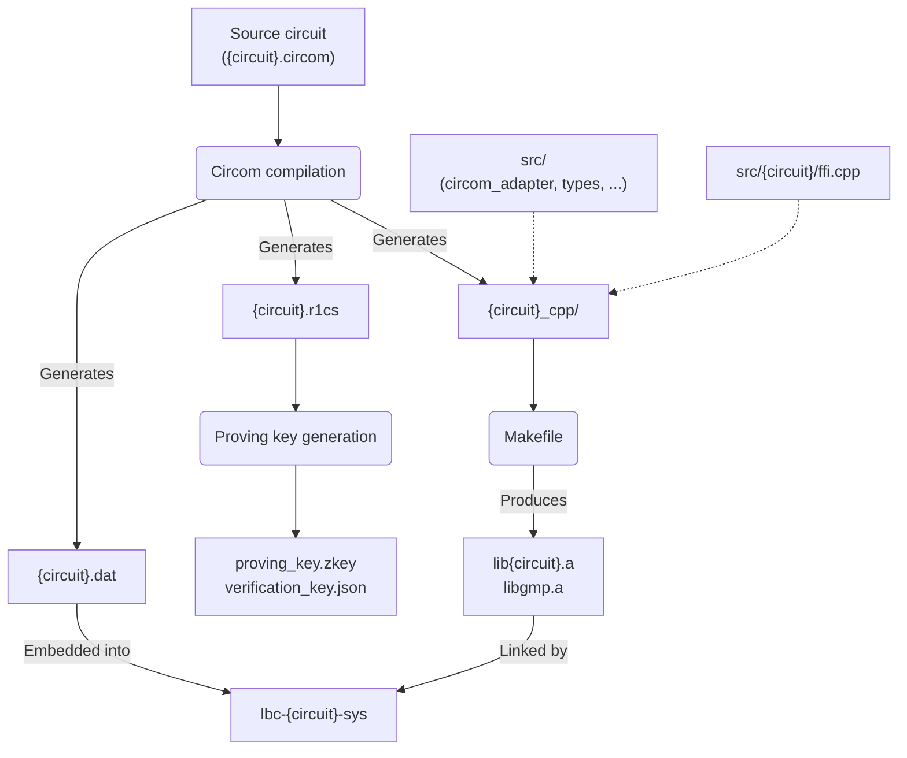

# Logos Blockchain Circuits

ZK-SNARK circuits for the [Logos Blockchain](https://github.com/logos-blockchain/logos-blockchain), built with
[Circom](https://docs.circom.io/) and distributed as linkable static libraries.

## Circuits

| Circuit                       | What it proves                                                    |
|-------------------------------|-------------------------------------------------------------------|
| **PoQ** — Proof of Quota      | A node has quota to participate in a blend session                |
| **PoL** — Proof of Leadership | A note holder would win the leadership lottery for a given slot   |
| **PoC** — Proof of Claim      | A voucher is validly owned and its nullifier is correctly derived |
| **Signature**                 | Knowledge of secret keys and their corresponding public keys      |

## Architecture

Each circuit is compiled from Circom source to C++, combined with shared common files (`circom_adapter`, `types`, ...)
and a circuit-specific FFI layer (`src/{circuit}/ffi.cpp`), and built into a static library.

The Rust sys crates link directly against these libraries.

## Docs

| Document                                         | What's in it                                               |
|--------------------------------------------------|------------------------------------------------------------|
| [CHANGELOG.md](CHANGELOG.md)                     | What changed and why, by version                           |
| [CONTRIBUTING.md](CONTRIBUTING.md)               | Dev setup, build details, and release process              |
| [rust/README.md](rust/README.md)                 | How to use the Rust sys crates                             |
| [docs/build-pipeline.md](docs/build-pipeline.md) | CI build steps, from `.circom` source to release artifacts |
